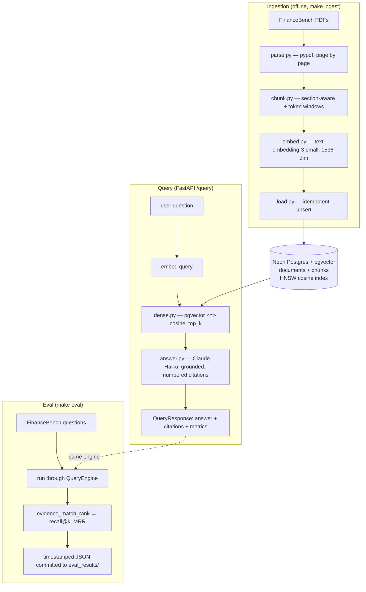

# sec-filings-rag

Read this file fully before touching code. It is the working contract for this repo.

## What this is

A retrieval-augmented QA service over US SEC filings (10-K, 10-Q, 8-K) plus an
eval harness that scores retrieval, latency, and cost against a public benchmark
(FinanceBench). The point of the project is the **eval rigor and the engineering
underneath**, not the chatbot. Numbers must be reproducible and honest.

Owner: Sai (Santosh Kandula). Audience for the work: engineering leads who will
read the code and scrutinize the numbers. Treat every output that way.

## Where we are now (read before planning)

- Phase: **V0**. Deadline **June 14, 2026**. Currently ~1 week behind schedule.
- V0 = **dense retrieval only**, FinanceBench corpus only (~360 PDFs).
- The repo is scaffolded and the pure-logic pieces (chunker, eval metrics) are
  unit-tested. Live services are **not** wired yet: no Neon DB, no API keys,
  no ingested PDFs. Tasks #4 (Neon), #5 (ingest), #6 (baseline eval) are next.
- Authoritative state lives in `docs/session-summary-2026-05-29.md`. Read it.

## Conceptual model

Three pipelines share one query path. The API and the eval harness call the same
`QueryEngine` — never build a second path.



## Hard scope boundaries — V0

In V0, build **only** dense retrieval. The following are designed but **out of
scope until V1/V2**. Do not add them, do not scaffold them, do not "just stub"
them unless explicitly told to:

- No hybrid retrieval / BM25.
- No cross-encoder reranker.
- No agentic tool/function calls.
- No corpus beyond FinanceBench (no EDGAR, no Finnhub news).
- No UI polish ahead of working retrieval.
- No new embedding/generation models — `text-embedding-3-small` + `claude-haiku-4-5`.

The design doc (`docs/design-doc.md`) describes the *full* V0→V2 system. It is locked.
**Any deviation from the locked scope requires a dated amendment in that doc with
a rationale.** If you think something should change, say so and propose the
amendment — do not silently implement it.

Two items are still open (see session summary): the V0 faithfulness badge
(currently `eval.faithfulness: false`) and the Haiku `PRICING` placeholder
(`0.0`, flagged `cost_is_estimate`). Don't put a real cost number in any writeup
until pricing is confirmed from the Anthropic pricing page.

## Engineering rules (non-negotiable)

1. **No fake APIs, ever.** Before calling a library function, confirm it exists in
   the pinned version. If unsure, say so — never invent a clean-looking call.
2. **Never fake or cherry-pick numbers.** Honest metrics even when they hurt.
3. **No code I can't read line by line.** Explain *why* (why this loss, this index,
   this chunk size), not just what. Pair every choice with its reason.
4. **Reproducible by default.** Fixed seeds, pinned versions (`requirements.lock`),
   no hardcoded local paths, temperature 0.0. If it can't be rerun, it doesn't count.
5. **Eval on real + edge cases**, not the easy split. Validate where it should break
   (e.g. dense retrieval confusing "grew 5%" vs "grew 25%" — a known failure mode).
6. **Ablation-friendly structure.** Every knob lives in `configs/v0.yaml` so one
   variable changes at a time. Strong experimental design > one impressive number.
7. **Simpler method first.** Dense baseline before anything heavier. No reaching
   for a bigger model when a smaller one answers the question.
8. **Secrets never committed.** `.env` is gitignored. Keys come from env only.
9. **FinanceBench is CC-BY-NC-4.0.** Non-commercial portfolio use. Do not
   redistribute the PDFs.

"Done" = working code + clear metrics + a short writeup of decisions and tradeoffs.
Match that shape without being asked.

## Commands

```
make install     # install deps into the env
make lock        # freeze exact versions -> requirements.lock (commit it)
make db-init     # apply db/schema.sql to Neon (needs DATABASE_URL)
make data        # fetch FinanceBench PDFs into data/
make ingest      # parse -> chunk -> embed -> load into pgvector
make eval        # run FinanceBench eval -> timestamped JSON in eval_results/
make demo        # launch Streamlit demo (start the API first)
make test        # pytest suite (chunker + eval metrics)
```

Run `make test` and (once live) the relevant `make` target after any change.
Don't report a task done on logic-only checks if it touches a live service.

## Project layout

```
src/sec_rag/
  config.py            # Secrets (env) split from Config (yaml); .require() fails loud
  pipeline.py          # QueryEngine — the one shared path (API + eval)
  db/{schema.sql,pool.py}      # documents+chunks, vector(1536), HNSW; psycopg3
  ingest/{financebench,parse,chunk,embed,load}.py
  retrieve/dense.py    # pgvector <=> cosine, score = 1 - distance
  generate/answer.py   # Claude Haiku, grounded prompt, parses [n] back out
  api/{app.py,schemas.py}      # FastAPI /health /query; schema = the contract
  eval/{metrics.py,run_financebench.py}
configs/v0.yaml        # every knob is an ablation lever
demo/streamlit_app.py  # cited vs retrieved badges; faithfulness slot
tests/                 # test_chunk.py, test_metrics.py (fake encoder, deterministic)
eval_results/          # committed JSON, one file per run
data/                  # FinanceBench PDFs (gitignored)
```

## Live-services map (what each thing actually unblocks)

- **Neon Postgres** → the vector store. `make db-init` applies `db/schema.sql`.
  Confirm the `vector` extension is enabled on the instance. Without it,
  `make ingest`, `/query`, and `make eval` all fail at the DB call.
- **OPENAI_API_KEY** → `embed.py`. Needed to embed both chunks (ingest) and the
  query (every `/query`). Dim must stay 1536 to match the schema.
- **ANTHROPIC_API_KEY** → `answer.py` (Claude Haiku generation).
- **DATABASE_URL** → `db/pool.py`. Long-lived conn for the engine, context-managed
  for ingest.
- **FinanceBench PDFs** → `data/`. `parse.py` reads them page-by-page so citations
  carry page numbers. Confirm the HF column names against the dataset card before
  trusting `financebench.py` field mapping.

Fill `.env` from `.env.example`, then `make install && make lock` and commit the lock.

## Reference docs

All live inside the repo under `docs/` so Claude Code can read and `@`-mention them:

- `docs/design-doc.md` — locked V0→V2 design. Source of truth for scope and eval.
- `docs/session-summary-2026-05-29.md` — latest state, open decisions, next actions.
- `docs/session-summary-2026-05-21.md` — original plan and schedule.

When in doubt about scope, the design doc wins. When in doubt about current state,
the latest session summary wins. When something contradicts these rules, stop and ask.
