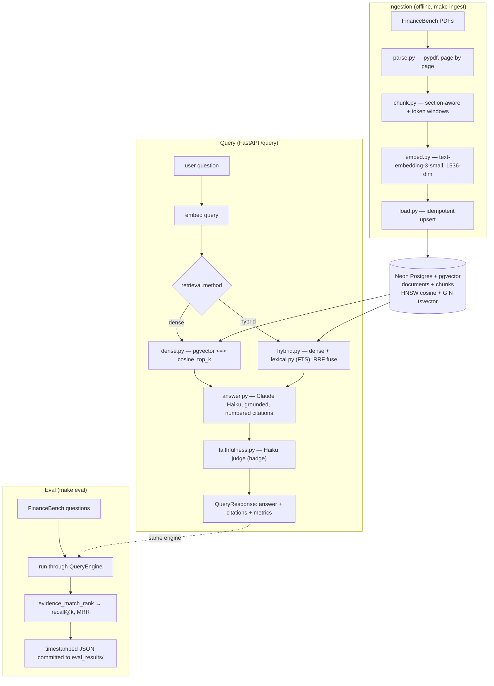

# sec-filings-rag

Read this file fully before touching code. It is the working contract for this repo.

## What this is

A retrieval-augmented QA service over US SEC filings (10-K, 10-Q, 8-K) plus an
eval harness that scores retrieval, latency, and cost against a public benchmark
(FinanceBench). The point of the project is the **eval rigor and the engineering
underneath**, not the chatbot. Numbers must be reproducible and honest.

Owner: Sai (Santosh Kandula). Audience for the work: engineering leads who will
read the code and scrutinize the numbers. Treat every output that way.

## Where we are now (read before planning) — updated 2026-06-11

- Phase: **V1.1** (hybrid retrieval). **V0 is complete and deployed** — landed
  ahead of the June 14 deadline.
- **Live services are wired.** Neon Postgres + pgvector is up (`vector` extension
  enabled); OpenAI + Anthropic keys work; the FinanceBench corpus is **ingested:
  84 documents, 25,992 chunks**. The API + Streamlit demo are deployed on Cloud
  Run (see `DEPLOY.md` for live URLs).
- **Committed V0 baseline** — `eval_results/financebench_20260605T020304Z.json`
  (150 questions, dense, fuzzy(0.5) match):

  | Metric | Measured | V0 floor | V2 target | Verdict |
  |---|---|---|---|---|
  | recall@5 | **0.44** | 0.55 | 0.75 | ✗ below floor |
  | recall@10 | 0.54 | — | — | — |
  | MRR | 0.317 | — | — | — |
  | faithfulness | **0.941** | 0.65 | 0.80 | ✓ |
  | cost / query | **$0.0063** | <$0.01 | <$0.005 | ✓ |
  | p95 latency | **~15.6 s** | <5 s | <2.5 s | ✗ over floor |

  Per-category recall@5: novel/prose **0.66**, metrics-generated (tables/numbers)
  **0.32**, domain-relevant **0.34**. The prose-vs-tables gap is the central
  finding and the V1 hypothesis: dense retrieval fails on financial tables/numbers
  (cosine is semantic not numeric; pypdf flattens tables).

- **Two V0 floors are missed (recall, latency).** That is honest and expected —
  V0 is the *baseline to beat*, not the finish line. V1 attacks recall; latency
  is a separate engineering concern (see Known debt below).
- Authoritative current state: this section + `docs/v1-plan.md`. The dated
  session summaries (`docs/session-summary-2026-05-*.md`) are historical.

### V1.1 status — hybrid code landed, A/B NOT yet valid

`retrieve/hybrid.py` + `retrieve/lexical.py` (dense + Postgres FTS, RRF fusion)
are written, tested for the pure-logic fusion, and committed (`configs/v1.yaml`,
`retrieval.method: hybrid`). **But the clean A/B vs the 0.44 baseline has not
validly completed.** The last hybrid eval (`...20260606T222705Z.json`, untracked)
aborted: only 73/150 scored, 77 errors all "Anthropic credit balance too low."
Its recall@5 0.274 is an artifact of a partial, non-random subset — **not a
result, do not cite it.** Re-run to completion before drawing any conclusion.

## Conceptual model

Three pipelines share one query path. The API and the eval harness call the same
`QueryEngine` — never build a second path. The retriever is selected by
`cfg.retrieval.method` (`dense` | `hybrid`); both paths return the same shape.



## Scope — phase boundaries

The design doc (`docs/design-doc.md`) describes the full V0→V2 system and is
**locked**. Any deviation requires a **dated amendment in that doc with a
rationale** — say so and propose the amendment, do not silently implement. (Five
amendments exist already; read the `## Amendments` section before proposing one.)

**V1 is executed as separate, individually-measured increments on the same
FinanceBench corpus** (per the 2026-06-06 amendment), to keep one variable
changing at a time against the committed 0.44 baseline:

- **V1.1 — Hybrid retrieval** (dense + Postgres FTS + RRF). ← *current.* Code
  done; eval must be re-run to completion and diffed vs 0.44.
- **V1.2 — Cross-encoder reranker** (BGE base) over hybrid candidates.
- **V1.3 — Corpus expansion** (S&P 100 via EDGAR + Finnhub news) + 100 hand-built
  labeled custom queries.
- **V1.4 — Full three-layer eval** (FinanceBench + custom 100 + faithfulness
  judge); per-category ablation table is the deliverable.

**Still out of scope until V2** — do not pull forward without a told-to-do-it:
time-decay scoring, table-extraction ablation, embedding-model comparison,
observability dashboards (OTel/Grafana/LangFuse), agentic tool calls.

**Lexical backend is fixed: core Postgres FTS** (`tsvector` + `ts_rank_cd`, GIN
index). `pg_search`/ParadeDB BM25 is **deprecated on Neon** and cannot be enabled
(verified against the live DB). Do not reach for it again.

## Engineering rules (non-negotiable)

1. **No fake APIs, ever.** Before calling a library function, confirm it exists in
   the pinned version. If unsure, say so — never invent a clean-looking call.
2. **Never fake or cherry-pick numbers.** Honest metrics even when they hurt.
   (recall@5 0.44 is below floor and stays reported as-is. Primary recall metric
   is **fuzzy(0.5)**; substring is published alongside as a strict lower bound.)
3. **No code I can't read line by line.** Explain *why* (why this loss, this index,
   this chunk size), not just what. Pair every choice with its reason.
4. **Reproducible by default.** Fixed seeds (13), pinned versions
   (`requirements.lock`), no hardcoded local paths, temperature 0.0. If it can't
   be rerun, it doesn't count.
5. **Eval on real + edge cases**, not the easy split. Validate where it should
   break (dense confusing "grew 5%" vs "grew 25%" — the tables/numbers failure
   mode now measured at recall@5 0.32).
6. **Ablation-friendly structure.** Every knob lives in `configs/*.yaml` so one
   variable changes at a time. `v0.yaml` is frozen so the baseline stays
   reproducible; new work goes in `v1.yaml`. Strong experimental design > one
   impressive number.
7. **Simpler method first.** Dense baseline before anything heavier. No reaching
   for a bigger model when a smaller one answers the question.
8. **Secrets never committed.** `.env` is gitignored. Keys come from env only.
   The deployed API is guarded by an `X-API-Key` header (see `api/app.py`).
9. **FinanceBench is CC-BY-NC-4.0.** Non-commercial portfolio use. Do not
   redistribute the PDFs.

"Done" = working code + clear metrics + a short writeup of decisions and tradeoffs.
Match that shape without being asked.

## Known engineering debt (on record, address before claiming production-grade)

- **Single shared DB connection serializes queries.** Safe (verified 6/6
  concurrent) but a throughput ceiling and a latency contributor. A connection
  pool is the fix.
- **p95 latency ~15.6 s is over the <5 s floor.** Generation + the inline
  faithfulness judge (a second Haiku call) dominate the critical path. Levers:
  connection pool, move the judge off the request path, batch.
- **Eval runner swallows infra failures.** The per-question resilience (commit
  `3b3880b`) let a billing outage masquerade as 77 question failures while still
  emitting aggregate recall. Harden it to treat billing/auth errors as fatal (or
  suppress aggregate metrics when `n_scored << n_questions`) so a partial run
  never looks like a result.
- Retrieval score is `1 - cosine_distance` (theoretically [-1,1]); clamp-for-
  display is optional. Lockfile pins the project itself, so re-run `pip install
  -e .` after `pip install -r requirements.lock`.

## Commands

```
make install                 # install deps into the env
make lock                    # freeze exact versions -> requirements.lock (commit it)
make db-init                 # apply db/schema.sql to Neon (needs DATABASE_URL)
make data                    # fetch FinanceBench PDFs into data/
make ingest                  # parse -> chunk -> embed -> load into pgvector
make eval                    # run FinanceBench eval (uses configs/v0.yaml)
make eval CONFIG=configs/v1.yaml   # eval the hybrid config -> timestamped JSON
make demo                    # launch Streamlit demo (start the API first)
make test                    # pytest suite (chunk, metrics, fusion, schemas, auth...)
```

Deploy is documented in `DEPLOY.md` (Cloud Run; `Dockerfile`, `Dockerfile.demo`).
Run `make test` and the relevant live `make` target after any change. Don't
report a task done on logic-only checks if it touches a live service — and don't
cite an eval JSON whose `n_scored < n_questions` or `n_errors > 0`.

## Project layout

```
src/sec_rag/
  config.py            # Secrets (env) split from Config (yaml); .require() fails loud
  pipeline.py          # QueryEngine — the one shared path (API + eval); picks retriever
  db/{schema.sql,pool.py}      # documents+chunks, vector(1536) HNSW + tsvector GIN; psycopg3
  ingest/{financebench,parse,chunk,embed,load}.py
  retrieve/dense.py    # pgvector <=> cosine, score = 1 - distance
  retrieve/lexical.py  # Postgres FTS (tsvector + ts_rank_cd), OR-ranked tsquery
  retrieve/hybrid.py   # dense + lexical, Reciprocal Rank Fusion (k≈60)
  generate/answer.py   # Claude Haiku, grounded prompt, parses [n] back out; PRICING
  generate/faithfulness.py     # self-contained Haiku judge (RAGAS definition); badge
  api/{app.py,schemas.py}      # FastAPI /health /query; X-API-Key guard; schema = contract
  eval/{metrics.py,run_financebench.py}    # recall@k/MRR/faithfulness/cost; --sleep throttle
configs/v0.yaml        # frozen V0 baseline knobs
configs/v1.yaml        # hybrid: retrieval.method, fusion params, candidates, k_rrf
demo/streamlit_app.py  # cited vs retrieved badges; faithfulness badge
Dockerfile, Dockerfile.demo, DEPLOY.md   # Cloud Run deploy
tests/                 # chunk, metrics, financebench, pricing, faithfulness, schemas, auth, hybrid
eval_results/          # committed JSON, one file per run (only complete runs)
data/                  # FinanceBench PDFs (gitignored)
```

## Live-services map (what each thing actually unblocks)

- **Neon Postgres** → the vector store + lexical store. `make db-init` applies
  `db/schema.sql` (HNSW cosine + GIN tsvector). `vector` extension is enabled.
- **OPENAI_API_KEY** → `embed.py`. Embeds chunks (ingest) and the query (every
  `/query`). Dim stays 1536 to match the schema.
- **ANTHROPIC_API_KEY** → `answer.py` (generation) **and** `faithfulness.py` (the
  judge). A depleted balance breaks `/query` generation and any eval run — top up
  before a full `make eval`.
- **DATABASE_URL** → `db/pool.py`. Long-lived autocommit conn for the engine,
  context-managed for ingest.
- **FinanceBench PDFs** → `data/`. `parse.py` reads page-by-page so citations
  carry 1-based page numbers (page-0 falsy-drop bug fixed).

Fill `.env` from `.env.example`, then `make install && make lock` and commit the lock.

## Reference docs

All live under `docs/` so Claude Code can read and `@`-mention them:

- `docs/design-doc.md` — locked V0→V2 design + the `## Amendments` log. Source of
  truth for scope, eval design, and success criteria. Read the amendments.
- `docs/v1-plan.md` — current V1 sequencing, the hybrid design, the lexical-backend
  findings, and the pre-registered V1.1 success criterion.
- `docs/session-summary-2026-05-29.md`, `-2026-05-21.md` — historical (V0 scaffold
  era). Do not treat as current state.

When in doubt about scope, the design doc (+ amendments) wins. When in doubt about
current state, this section + `v1-plan.md` win. When something contradicts these
rules, stop and ask.
