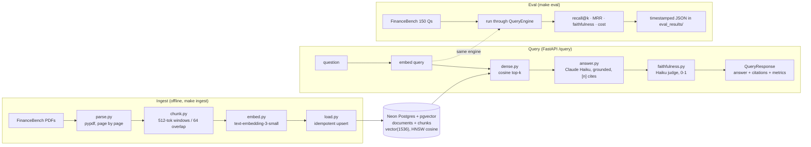

# sec-filings-rag

Retrieval-augmented question answering over US public-company SEC filings, plus a
measurement harness that scores retrieval, faithfulness, latency, and cost across
design ablations. The design doc is the spec: [`docs/design-doc.md`](docs/design-doc.md).

The point of the project is not one pipeline. It is showing which design choices
(chunking, embedding model, retrieval method, reranking) move which metric, and at
what cost, measured against a public benchmark (FinanceBench).

## Live demo

- **Demo:** https://sec-rag-demo-cpsb7kmoqa-ue.a.run.app
- **API:** https://sec-rag-api-cpsb7kmoqa-ue.a.run.app (`/query` guarded by an
  `X-API-Key`; `/health` and `/docs` open)

Both run on Cloud Run (scale-to-zero — first request after idle has a ~15 s cold
start). Deploy steps: [`DEPLOY.md`](DEPLOY.md).

## Status

**V0 baseline measured and deployed.** The full pipeline runs end-to-end: 84
FinanceBench documents ingested (25,992 chunks in pgvector), dense retrieval,
Claude Haiku generation with citations, an inline faithfulness judge, and a
FastAPI `/query` service with a Streamlit demo, both live on Cloud Run. Results
below are reproducible via `make eval`.

V0 is dense retrieval only — hybrid retrieval and reranking are V1/V2 and are not
in this tree yet, by design. The honest below-floor recall is exactly what those
V1 additions are meant to lift.

## Results (V0 baseline, FinanceBench 150)

Latest run: [`eval_results/financebench_20260605T020304Z.json`](eval_results/).
Primary match mode is **fuzzy** (token-overlap ≥ 0.5); substring is reported as a
strict lower bound (see the 2026-06-03 design-doc amendment for why).

| Metric | V0 result | V0 floor | Notes |
|---|---|---|---|
| recall@5 (fuzzy) | **0.44** | 0.55 | dense-only baseline; below floor by design |
| recall@10 (fuzzy) | 0.54 | — | |
| MRR | 0.317 | — | |
| faithfulness | **0.941** | 0.65 | Haiku judge; grounded-claims ratio |
| cost / query | **$0.0063** | < $0.01 | confirmed Haiku 4.5 pricing, not an estimate |
| p95 latency | 15.6 s | < 5 s | two Haiku calls/query (answer + judge) |

**Per-category recall@5** isolates the failure mode: prose questions
(`novel-generated`) score **0.66**, but table/number questions
(`metrics-generated` 0.32, `domain-relevant` 0.34) lag — dense retrieval over
financial tables is the known weak spot, and the V1 hybrid+reranker target.
Faithfulness 0.94 shows the answers that *are* given stay grounded (the system
refuses rather than hallucinating when retrieval misses).

## Architecture

The API and the eval harness call the **same** `QueryEngine.run()` — the numbers
reported are produced by the exact path a user hits, so eval can't drift from
production.



**Per query:** embed (OpenAI, 1536-d) → cosine top-k from pgvector (HNSW) →
grounded Haiku answer with parsed `[n]` citations → Haiku faithfulness judge →
structured `QueryResponse`. A `SEC_RAG_API_KEY` header guards `/query` in
production; secrets are env-only, never in the image.

## Layout

```
sec-filings-rag/
  configs/v0.yaml            ablation knobs (chunk size, embed model, top_k, ...)
  src/sec_rag/
    config.py                load .env + yaml into a typed Settings object
    ingest/
      financebench.py        load the FinanceBench dataset rows + locate PDFs
      parse.py               PDF -> page text (pypdf)
      chunk.py               token-based, section-aware chunker (implemented)
      embed.py               OpenAI embeddings wrapper (text-embedding-3-small)
      load.py                parse -> chunk -> embed -> write to pgvector
    db/
      schema.sql             documents + chunks tables, HNSW cosine index
      pool.py                psycopg connection + pgvector registration
    retrieve/dense.py        dense top-k over pgvector cosine distance
    generate/
      answer.py              Claude Haiku call, returns answer + citations
      faithfulness.py        inline groundedness judge (Haiku), 0-1 score
    api/
      app.py                 FastAPI: GET /health, POST /query
      schemas.py             response models matching the design-doc JSON
    eval/
      metrics.py             recall@k, MRR (implemented + tested)
      run_financebench.py    eval runner -> timestamped JSON in eval_results/
  demo/streamlit_app.py      V0 demo: answer + citations + faithfulness/latency badges
  tests/                     unit tests for chunk + metrics
  eval_results/              committed JSON, one file per run
  data/                      FinanceBench PDFs (gitignored, not redistributed)
```

## Setup

Requires Python 3.11, a Neon Postgres database with the `vector` extension
available, and OpenAI + Anthropic API keys.

```bash
cp .env.example .env          # fill in OPENAI_API_KEY, ANTHROPIC_API_KEY, DATABASE_URL
make install                  # editable install + dev/demo extras
make lock                     # freeze exact versions -> requirements.lock (commit it)
make db-init                  # apply db/schema.sql to $DATABASE_URL
# FinanceBench PDFs are NOT auto-downloaded (CC-BY-NC, company-sourced). Clone
# github.com/patronus-ai/financebench and copy its pdfs/ into data/. `make data`
# only checks/instructs; it does not fetch.
make ingest                   # parse -> chunk -> embed -> load to pgvector (~$0.21 embeddings)
make eval                     # FinanceBench recall + faithfulness + cost -> eval_results/<ts>.json
make demo                     # Streamlit demo (start the API first: uvicorn sec_rag.api.app:app)
```

Note: `requirements.lock` pins the project itself, so re-running
`pip install -r requirements.lock` de-edits the editable install. If `import
sec_rag` stops resolving, run `pip install -e .` again.

For a full eval on a low API rate limit, throttle it: `python -m
sec_rag.eval.run_financebench --config configs/v0.yaml --match-mode fuzzy
--sleep 1.0` (faithfulness adds a second Haiku call per question).

## What works

End-to-end and measured (see Results): PDF parse → section/token chunking →
OpenAI embeddings → pgvector HNSW retrieval → Haiku generation with parsed `[n]`
citations → inline faithfulness judge → `/query` API → Streamlit demo, plus the
`make eval` harness writing timestamped JSON.

Hardened against the failure modes real data and live services surfaced:
NUL-byte and AES-encrypted PDFs, the pgvector `<=>` type cast, idle-transaction
and dropped-connection recovery, `top_k` bounds, per-question eval resilience,
and indirect prompt injection (a malicious chunk cannot override the grounded
system prompt — verified). 43 unit tests cover the pure logic (chunker, metrics,
schema bounds, cost, faithfulness parsing).

## Reproducibility

Fixed seed in `configs/v0.yaml` (`eval.seed`) for any sampling step.
`temperature: 0.0` for generation. `make lock` writes exact installed versions to
`requirements.lock`, which is committed alongside the constraint floor in
`pyproject.toml`. Eval output is written to `eval_results/<timestamp>.json` and
committed per run, so a number in the writeup traces to a specific file.

## License note

FinanceBench is CC-BY-NC-4.0. This is non-commercial portfolio work; the PDFs are
not redistributed in this repo (`data/` is gitignored). Fetch them yourself from
the source repo (github.com/patronus-ai/financebench, `pdfs/`) into `data/`.
