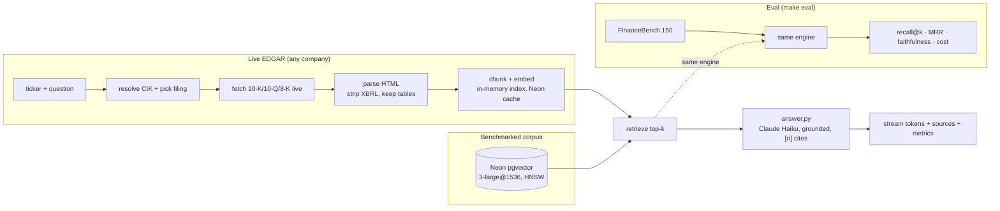

# sec-filings-rag

Retrieval-augmented QA over US SEC filings, built two ways: a **live tool** that
answers about any public company from its newest filings, and a **benchmarked
engine** behind it whose every design choice was measured one variable at a time
against a public benchmark (FinanceBench).

The point was never one pipeline — it's *proving which choice moves which metric,
and at what cost.* The result is a measured ablation (recall@5 0.44 → **0.64**,
tables 0.32 → **0.70**) plus a live product that scales the same RAG to ~10,400
companies.

## ▶ Live demo

**https://sec-rag-web-200217758117.us-east1.run.app**

Enter a ticker (AAPL, NVDA, TSLA…) and ask — it pulls that company's latest
**10-K / 10-Q / 8-K live from EDGAR** (auto-detected from your question), indexes
it on the fly, and **streams** a grounded, cited answer. Ask to *compare* across
years and it pulls multiple filings. Leave the ticker blank to query the
pre-indexed FinanceBench sample corpus. Optional **BYOK** (⚙) runs it on your own
OpenAI + Anthropic keys.

*First query on a never-seen filing is ~15–25 s (fetch + embed); cached after that.*

## What it does

**Two surfaces, one shared RAG engine** (chunk → embed → retrieve → grounded,
cited generation → stream):

- **Live EDGAR path** — any company, newest filings, fetched + indexed on demand
  (in-memory exact-cosine index → no storage cap), cached in Neon across cold
  starts, citations labeled by SEC Item ("Item 1A. Risk Factors"), per-IP rate
  limit + BYOK for safe public sharing.
- **Benchmarked path** — the FinanceBench corpus pre-indexed in pgvector, scored by
  the `make eval` harness. This is the *measured* core; the API and the eval call
  the **same** engine, so the numbers describe the deployed system.

## Results (V2 baseline, FinanceBench 150)

Live config: dense + **`text-embedding-3-large` @ 1536-d** (Matryoshka) +
**1024-token chunks**. Primary metric is fuzzy(0.5); JSONs in `eval_results/`.

| Metric | V0 (3-small/512) | **V2 (3-large@1536/1024)** | V2 target |
|---|---|---|---|
| recall@5 | 0.44 | **0.64** | 0.75 |
| recall@10 | 0.54 | **0.74** | — |
| tables@5 | 0.32 | **0.70** | — |
| faithfulness | 0.94 | **0.93** | 0.80 ✓ |
| cost / query | $0.0063 | ~$0.005–0.009 | <$0.005 |

The headline came from **one lever — the embedding model** — found by rejecting
five others (hybrid, reranker ×2, table-extraction, smaller chunks) in a measured
ablation. The full table and the reasoning are in
[`docs/depth-round.md`](docs/depth-round.md); a version-by-version summary is in
[`docs/versions.md`](docs/versions.md) and the decisions/steps narrative in
[`docs/decisions-and-steps.md`](docs/decisions-and-steps.md).

## Architecture

The API and the eval harness call the **same** engine — eval can't drift from
production.



## Repo layout (high level)

```
src/sec_rag/
  pipeline.py            QueryEngine — the shared path (API + eval); streaming
  edgar/                 live EDGAR: client.py (fetch/parse) + live_engine.py (on-demand RAG)
  ingest/                parse -> chunk -> embed -> load (benchmarked corpus)
  retrieve/              dense / hybrid / lexical / rerank (hybrid+rerank measured, retired)
  generate/              answer.py (Haiku, cited) + faithfulness.py (judge)
  api/app.py             FastAPI: /health, /query, /query/stream, /query/live/stream
  eval/                  run_financebench.py + the ablation scripts
web/                     static frontend (GitHub Pages) — index.html / app.js / style.css
configs/                 v0.yaml (frozen baseline), v2.yaml (live config)
docs/                    design-doc (+amendments), depth-round, versions, decisions-and-steps
eval_results/            committed JSON, one file per complete run
```

## Run it yourself

Requires Python 3.11, a Neon Postgres DB with `vector`, and OpenAI + Anthropic keys.

```bash
cp .env.example .env          # OPENAI_API_KEY, ANTHROPIC_API_KEY, DATABASE_URL
make install && make lock
make db-init                  # apply db/schema.sql
# FinanceBench PDFs (CC-BY-NC) are not auto-fetched — copy them into data/.
make ingest CONFIG=configs/v2.yaml   # parse -> chunk -> embed -> pgvector
make eval   CONFIG=configs/v2.yaml   # recall + faithfulness + cost -> eval_results/<ts>.json
```

Run the API + frontend locally: `SEC_RAG_CONFIG=configs/v2.yaml uvicorn
sec_rag.api.app:app --port 8000`, then serve `web/` (`python -m http.server 8080`
in `web/`) — it auto-points at the local API. Cloud Run deploy: [`DEPLOY.md`](DEPLOY.md).

## Notes

- **Reproducible:** fixed seed (13), temp 0, pinned `requirements.lock`, eval JSON
  committed per run. 70 unit tests cover the pure logic.
- **License:** FinanceBench is CC-BY-NC-4.0 — non-commercial portfolio work; PDFs
  are not redistributed (`data/` is gitignored).
