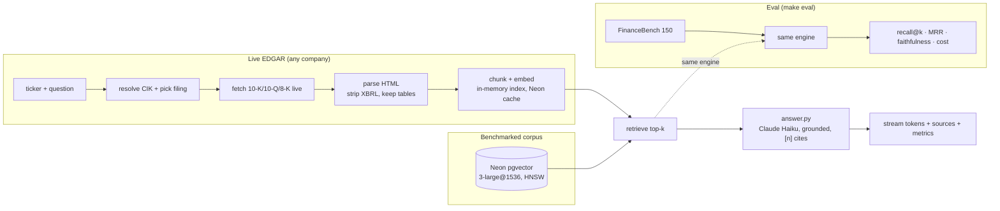

<div align="center">

<h1>🔍 SEC-RAG-Eval</h1>

<p><strong>An evaluation platform for retrieval-augmented QA over SEC filings.</strong><br/>
<em>The measurement rigor is the product — the chatbot is just the subject under test.</em></p>

<a href="https://sec-rag-web-200217758117.us-east1.run.app">
  
</a>

<p>
  <a href="https://sec-rag-web-200217758117.us-east1.run.app"></a>
  <a href="https://github.com/skandula9273/sec-rag-eval/actions/workflows/tests.yml"></a>
  <a href="https://github.com/skandula9273/sec-rag-eval/actions/workflows/eval-ci.yml"></a>
  
  
  <a href="LICENSE"></a>
  <a href="https://github.com/astral-sh/ruff"></a>
</p>

<p>
  <a href="#-live-demo">Demo</a> ·
  <a href="#-results">Results</a> ·
  <a href="#-metric-honesty">Metric honesty</a> ·
  <a href="#-architecture">Architecture</a> ·
  <a href="#-quickstart">Quickstart</a> ·
  <a href="#-docs">Docs</a>
</p>

</div>

---

## What this is

A retrieval-augmented QA service over US **SEC filings** (10-K / 10-Q / 8-K) **and**
the evaluation harness that measures it. The harness is the point: it brackets recall
across three matchers, checks that bracket against **human labels**, has a second model
**audit the LLM judge**, runs **one-variable ablations**, **crosses the confounds**
before claiming a win, and gates **every PR** on a committed recall baseline.

The RAG system is the *subject under test*. The platform's job is to say **which design
choice moved which metric, by how much, and how much of that was real rather than an
artifact of how it was scored** — and to say so even when the honest answer is *"less
than I first claimed."*

> **Two surfaces, one shared engine.** A **live EDGAR tool** answers about any of the
> **~10,400 companies** in EDGAR's ticker→CIK map from their newest filing on demand,
> and a **benchmarked engine** runs over an **84-filing / 15,192-chunk** FinanceBench
> corpus. The API and the eval call the *same* `QueryEngine`, so the numbers below
> describe the deployed system — not a lab mock-up.

## ✨ Highlights

- 🎯 **Honest headline** — recall@5 **0.44 → 0.64** (fuzzy), correctness **0.50**,
  faithfulness **0.93**. Read as *brackets, not points* — the caveats are in the open,
  not buried.
- 🔬 **Caught its own false positive** — an LLM-proxy label study once "validated" the
  shipped matcher at **κ 0.67**; hand-labeling the same 50 pairs dropped it to **κ 0.18**.
  The repo shipped the clean result, then caught and corrected it. → [`metric-validity-study.md`](docs/metric-validity-study.md)
- ⚖️ **Confounds crossed before claiming a win** — the V0→V2 gain decomposes to
  **~80% real system improvement, ~20% chunk-size metric inflation** via a full
  2×3×3 grid.
- 🧪 **Judge audited, not trusted** — a second model (Opus) re-checked the faithfulness
  judge on 20 verdicts and agreed **19/20**; the one miss was *harsh*, not lenient.
- 🚦 **Eval runs in CI** — every PR scores a committed 30-question subset against a
  frozen recall baseline and posts a delta table.
- 🌐 **Actually deployed** — live on Cloud Run, streaming, section-cited, BYOK,
  rate-limited. **Warm** server **p50 2.1 s / p95 6.2 s**, **~$0.0045/query** (measured,
  `api_latency_20260731T004411Z.json`).

---

## ▶ Live demo

### **[→ sec-rag-web-200217758117.us-east1.run.app](https://sec-rag-web-200217758117.us-east1.run.app)**

Enter a ticker (**AAPL, NVDA, TSLA**…) and ask — it pulls that company's latest
**10-K / 10-Q / 8-K live from EDGAR** (auto-detected from your question), indexes it on
the fly, and **streams** a grounded, cited answer. Ask to *compare* across years and it
pulls multiple filings. Leave the ticker blank to query the pre-indexed FinanceBench
sample corpus. Optional **BYOK** (⚙) runs it on your own OpenAI + Anthropic keys.

> _No keys needed — the demo runs on the owner's rate-limited keys. **Latency:** the
> first visit after full idle wakes the web host — a **~13 s Cloud Run scale-to-zero cold
> start** (observed; **distinct** from the API's *warm* server p50 ~2 s in the latency
> benchmark, and from that benchmark's 1.9 s first-request-in-batch, which hits an
> already-running container). Warm queries are ~2 s (indexed corpus) / ~6 s (a new EDGAR
> filing, then cached) — both observed. **Last verified live: 2026-07-31** — `/health`
> ok, keyless query ok._

<div align="center">

</div>

---

## 📊 Results

**V2 baseline, FinanceBench 150.** Live config: dense retrieval +
**`text-embedding-3-large` @ 1536-d** (Matryoshka) + **1024-token chunks**. Primary
metric is fuzzy(0.5); every run's JSON is committed under [`eval_results/`](eval_results/).

| Metric | V0 (3-small / 512) | **V2 (3-large@1536 / 1024)** | V2 target |
|---|:---:|:---:|:---:|
| recall@5 (fuzzy) | 0.44 | **0.64** | 0.75 |
| recall@10 (fuzzy) | 0.54 | **0.74** | — |
| tables@5 (fuzzy) | 0.32 | **0.70** | — |
| faithfulness | 0.94 | **0.93** | 0.80 ✅ |
| cost / query | $0.0063 | ~$0.017 (top_k=20) | <$0.005 |

> <sub>**Provenance (the V2 column mixes runs by what each measures).** V0 is one run
> (`financebench_20260605T020304Z.json`). V2: **recall / tables** from the retrieval-only
> v2 baseline (`financebench_20260629T160938Z.json`); **faithfulness 0.93** from the
> full-pipeline runs (**0.929** verbose `…20260629T193049Z`, **0.934** concise
> `…20260731T025337Z`) — *not* from the accuracy run, which runs the judge **off**;
> **cost $0.017** at the deployed top_k=20 (`…20260731T115740Z`, $0.0166/q). The live API
> (top_k=5, judge off) is cheaper still at **$0.0045/q**.</sub>

**Read recall@5 as a bracket, not a point.** The *same* V2 retrieval reads very
differently depending on how a "hit" is scored:

```
strict substring        fuzzy(0.5) ← shipped         semantic
   0.093  ●─────────────────── 0.64 ●───────────────────● 0.807
 (gold span must         (≥50% of gold tokens         (embedding
  survive verbatim)       appear in a chunk)           similarity)
```

> **Bracket source:** `matcher_study_baseline_20260731T123250Z.json` — the live v2 config
> (Neon corpus) scored under all three matchers over the *same* retrieval (0.0933 / 0.64 /
> 0.8067). This is a **different run** from the confound grid, whose local-exact-index
> 3-large/1024 row reads **0.0933 / 0.6467 / 0.8133** (`confound_grid_20260731T162218Z.json`).

<details>
<summary><strong>Why recall is a bracket — and where the honest number sits</strong></summary>

<br/>

fuzzy(0.5) counts a hit when ≥50% of a question's gold-evidence *tokens* appear anywhere
in a retrieved chunk — order-free, and blind to number swaps ("grew 5%" vs "grew 25%").
Under **strict substring** matching (the gold span must appear verbatim in one chunk) the
same V0 config scores recall@5 **0.0667** and tables@5 **0.00**
(`financebench_20260604T022143Z.json`) — FinanceBench's gold spans are large, multi-line
tables that rarely survive a chunk boundary intact, so substring **understates** while
fuzzy is the **generous** end; true recall sits between them.

One coupling to keep honest: *"recall@k is partly inflated by larger chunks (fuzzy overlap
vs large gold spans)"* (`ablation_chunksize_large_20260627T205004Z.json`) — a 1024-token
chunk clears the 50% bar more easily than a 512, so part of the chunk-size gain is metric,
not retrieval. That inflation is quantified in the confound study below.

</details>

<details>
<summary><strong>Confound decomposition — how much of +0.207 was real?</strong></summary>

<br/>

The V0→V2 jump moved **two** variables — the embedding model (3-small → 3-large@1536)
*and* chunk size (512 → 1024). The **full grid is crossed** (2 models × 3 chunk sizes × 3
matchers, retrieval-only; `eval_results/confound_study_20260731T170928Z.json`), filling
the 3-small@1024 cell that had never been run and showing the two effects are **additive
(interaction ≈ 0)**. Decomposing the **+0.207** overlap recall@5 gain:

- **embedding +0.127** (61%) — *real*: answer accuracy rises +0.08 and refusals fall
  0.51 → 0.39 across the same change.
- **chunk-size +0.080** (39%), but only **~+0.037 is real** (it survives the strict and
  semantic matchers, and accuracy rises a matching +0.033); the other **~+0.043 is
  overlap-metric inflation** — a bigger chunk clears the 50%-token bar more easily,
  independent of retrieval quality.

So **~80% of the headline is real system improvement** and **~20% is chunk-size metric
inflation.** The arbiter is answer accuracy — which *cannot* be inflated by chunk size —
and it climbs V0→V2 by **+0.11 (0.36 → 0.47)**, almost all from the embedding model.
(Chunk benefit saturates by 1024: 2048 is flat or negative.) Five other levers (hybrid,
reranker ×2, table-extraction, smaller chunks) were measured and **rejected** — full table
in [`docs/depth-round.md`](docs/depth-round.md).

</details>

### 🎯 Answer accuracy — is the final answer *right*, not just retrieved?

Recall says nothing about whether the *answer* matches FinanceBench's gold. Scored on all
150 at the live serving depth (top_k=20; LLM judge = Haiku, recorded in the JSON;
`eval_results/financebench_20260731T115740Z.json`, 0 errors):

| Metric | Value | Basis |
|---|:---:|---|
| LLM-graded accuracy (of attempted) | **0.74** | 75 / 102 answered |
| LLM-graded accuracy (over all 150) | **0.50** | refusals counted as not-correct |
| numeric-exact accuracy | **0.85** | 45 / 53 single-figure golds |
| **refusal rate** | **0.32** | 48 / 150 |

The two accuracy numbers differ by exactly the **refusal rate, reported separately on
purpose**: the grounded prompt declines ("I cannot answer this from the provided sources")
rather than guessing when the evidence isn't retrieved. Right ~74% of what it attempts,
honest about the third it can't. Rules for the numeric normalizer (currency / scale / sign
/ percent, `$1.2B = 1,200 million`) live in
[`src/sec_rag/eval/answer_accuracy.py`](src/sec_rag/eval/answer_accuracy.py).

---

## 🔬 Metric honesty

The standout of this repo isn't the recall number — it's that the repo **caught itself
over-claiming and published the correction.**

recall is an evidence-hit rate, and that rate is mostly a property of the **matcher**, not
the retriever. So a 50-pair study asked: *which matcher does a human actually agree with?*

- An early pass used a **Claude (Haiku) proxy labeler** and ranked the shipped fuzzy
  (overlap) matcher **best of three at κ 0.67** (`metric_validity_scores_20260731T140147Z.json`).
- **Hand-labeling the same 50 pairs** dropped it to **κ 0.18 ("slight") — second of
  three** (behind strict κ 0.21; semantic κ 0.08), **with no matcher beating chance at
  n=50** (every κ's 95% CI includes 0). Source: `metric_validity_scores_20260801T211535Z.json`.

> **Read these κ's as agreement on *contested* pairs, not a population rate.** The 50
> pairs are **disagreement-oversampled** (drawn where the matchers disagree), per the
> artifact's own `sample_note` — so they stress the matchers, they don't estimate a
> corpus-wide agreement rate.

The clean validation was an **artifact of the LLM labeler.** This repo shipped it once,
then caught it — and the CI gate now keeps the fuzzy matcher for *continuity and
regression detection*, explicitly **not** because it was singled out as best.

→ Full study: [`docs/metric-validity-study.md`](docs/metric-validity-study.md) ·
[`docs/metric-validity.md`](docs/metric-validity.md)

<details>
<summary><strong>The faithfulness judge is audited, not trusted</strong></summary>

<br/>

A second model (Opus) re-checked the Haiku faithfulness judge on 20 verdicts — **19/20
agree**, and the one miss is *harsh*, not lenient — so the committed **0.929** isn't a
soft self-grade. Faithfulness is **grounding, not correctness**: several answers are
faithful-but-wrong (grounded in the wrong retrieved evidence), which is why measured
correctness is a separate **0.50** over 150 questions.
→ [`docs/faithfulness-spotcheck.md`](docs/faithfulness-spotcheck.md)

</details>

---

## 🏗️ Architecture

The API and the eval harness call the **same** engine — eval can't drift from production.


```mermaid
flowchart LR
    subgraph LIVE["Live EDGAR (any company)"]
        T[ticker + question] --> RES[resolve CIK + pick filing]
        RES --> FET[fetch 10-K/10-Q/8-K live]
        FET --> PAR[parse HTML<br/>strip XBRL, keep tables]
        PAR --> IDX[chunk + embed<br/>in-memory index, Neon cache]
    end
    subgraph CORPUS["Benchmarked corpus"]
        DB[("Neon pgvector<br/>3-large@1536, HNSW")]
    end
    IDX --> RET[retrieve top-k]
    DB --> RET
    RET --> GEN["answer.py<br/>Claude Haiku, grounded, [n] cites"]
    GEN --> ST[stream tokens + sources + metrics]
    subgraph EVAL["Eval (make eval)"]
        FB[FinanceBench 150] --> RUN[same engine] --> SC["recall@k · MRR · faithfulness · cost"]
    end
    RET -. same engine .-> RUN
```

<details>
<summary><strong>Repo layout</strong></summary>

<br/>

```
src/sec_rag/
  pipeline.py            QueryEngine — the shared path (API + eval); streaming
  edgar/                 live EDGAR: client.py (fetch/parse) + live_engine.py (on-demand RAG)
  ingest/                parse -> chunk -> embed -> load (benchmarked corpus)
  retrieve/              dense / hybrid / lexical / rerank (hybrid+rerank measured, retired)
  generate/              answer.py (Haiku, cited) + faithfulness.py (judge)
  api/app.py             FastAPI: /health, /query, /query/stream, /query/live/stream
  eval/                  run_financebench.py + the ablation scripts
web/                     static frontend (served from Cloud Run, no-store) — index.html / app.js / style.css
configs/                 v0.yaml (frozen baseline), v2.yaml (live config)
docs/                    design-doc (+amendments), depth-round, versions, decisions-and-steps
eval_results/            committed JSON, one file per complete run
```

</details>

---

## 🚀 Quickstart

Requires **Python 3.11**, a Neon Postgres DB with `vector`, and OpenAI + Anthropic keys.

```bash
cp .env.example .env          # OPENAI_API_KEY, ANTHROPIC_API_KEY, DATABASE_URL
make install && make lock
make db-init                  # apply db/schema.sql
# FinanceBench PDFs (CC-BY-NC) are not auto-fetched — copy them into data/.
make ingest CONFIG=configs/v2.yaml   # parse -> chunk -> embed -> pgvector
make eval   CONFIG=configs/v2.yaml   # recall + faithfulness + cost -> eval_results/<ts>.json
```

Run the API + frontend locally:

```bash
SEC_RAG_CONFIG=configs/v2.yaml uvicorn sec_rag.api.app:app --port 8000
cd web && python -m http.server 8080     # auto-points at the local API
```

Cloud Run deploy: [`DEPLOY.md`](DEPLOY.md).

<details>
<summary><strong>Reproducibility — what a fresh clone can and cannot rerun</strong></summary>

<br/>

Honest scope, measured on a pristine `git archive` of `HEAD` (**no `.env`, no `data/`, no
committed embeddings**):

- ✅ **Reproduces from a clean clone, offline, no secrets — the test suite.** After
  `pip install -e ".[dev]"`, `pytest` runs all **118 tests** (104 functions) with no
  network, no API keys, and no database — pure logic: chunking, metrics, the matchers,
  pricing, API schemas, auth, the eval fail-fast classifier. *This* is the one-command
  guarantee, and it's what the `tests` badge above runs on every PR.
- 🔑 **Reproduces only with keys + the maintainer's corpus — the eval numbers.**
  `make eval` embeds each query (OpenAI) and retrieves against the **274 MB v2 corpus that
  lives in Neon, not the repo**. The committed **`eval_results/*.json`** are the frozen
  record of every past run (seed 13, temp 0, pinned lockfile) — auditable, but a *record*,
  not something a fresh clone recomputes.
- 🚫 **Cannot be reproduced from scratch by a third party — the full ingest pipeline.**
  The **FinanceBench PDFs are CC-BY-NC-4.0 and gitignored** (not redistributable); `make
  data` points at the official downloader, it does not auto-fetch.

In short: **`pytest` is genuinely `git clone` + one command; the headline recall is not** —
it needs data and a database the repo (correctly) does not ship.

</details>

<details>
<summary><strong>eval-as-CI — the smoke gate on every PR</strong></summary>

<br/>

Every PR runs a **retrieval-only smoke eval**
([`.github/workflows/eval-ci.yml`](.github/workflows/eval-ci.yml)): it retrieves for a
**committed 30-question subset** (seed 13, 10 per category —
[`eval_results/ci_subset.jsonl`](eval_results/ci_subset.jsonl)) and scores **recall@5 under
the `overlap` matcher**, failing if it drops more than `max_drop` (0.10) below the committed
baseline (0.6333). It posts a delta table as a PR comment. Gate parameters live in
[`configs/ci_eval.yaml`](configs/ci_eval.yaml), so tightening the gate is a reviewable
one-line diff.

**Operational choices:** retrieval-only, so **no Anthropic call and ~$0.001/run**; secrets
come from repo secrets and it **skips gracefully when they're absent** (fork PRs /
Dependabot don't fail confusingly); a `max_questions` ceiling + a 15-min timeout bound
every run.

**What it does NOT catch — it's a smoke test, not the benchmark.** 30 questions means each
is ±0.033 recall@5, so the gate is coarse (0.10 ≈ 3 questions). It measures retrieval recall
only: no answer accuracy, no faithfulness, no latency/cost. The **full n=150 benchmark** is
deliberately a manual / release-time step (`make eval CONFIG=configs/v2.yaml --accuracy`).

</details>

---

## 📚 Docs

| Doc | What's in it |
|---|---|
| [`docs/design-doc.md`](docs/design-doc.md) | Locked V0→V2 design + the amendments log — source of truth for scope and success criteria |
| [`docs/depth-round.md`](docs/depth-round.md) | The full ablation record: every lever measured, kept, or rejected |
| [`docs/metric-validity-study.md`](docs/metric-validity-study.md) | The 50-pair human-label study and the LLM-labeler false positive |
| [`docs/faithfulness-spotcheck.md`](docs/faithfulness-spotcheck.md) | Opus-adjudicated audit of the Haiku faithfulness judge |
| [`docs/versions.md`](docs/versions.md) · [`docs/decisions-and-steps.md`](docs/decisions-and-steps.md) | Version-by-version summary + the decisions/steps narrative |
| [`DEPLOY.md`](DEPLOY.md) | Cloud Run deploy (Dockerfiles, env, redeploy) |

---

## 📄 License

Code is **[MIT](LICENSE)**. The **FinanceBench** dataset (questions, gold answers, PDFs) is
**CC-BY-NC-4.0** by Patronus AI — non-commercial, and **not redistributed** here (`data/`
is gitignored). This is portfolio work; the PDFs are yours to fetch from the
[official repo](https://github.com/patronus-ai/financebench) for non-commercial use.

<div align="center">
<sub>Built by <a href="https://github.com/skandula9273">Santosh Kandula</a> · reproducible by default (seed 13, temp 0, pinned lockfile)</sub>
</div>
