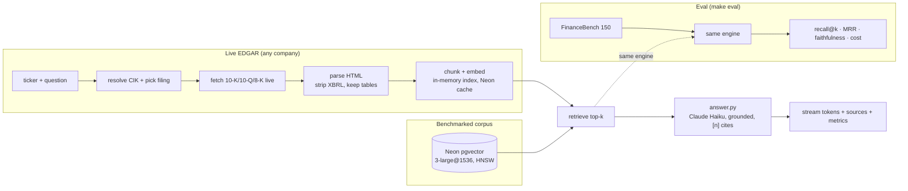

# sec-filings-rag

Retrieval-augmented QA over US SEC filings, built two ways: a **live tool** that
answers about any public company from its newest filings, and a **benchmarked
engine** behind it whose every design choice was measured one variable at a time
against a public benchmark (FinanceBench).

The point was never one pipeline — it's *proving which choice moves which metric,
and at what cost.* The result is a measured ablation over an **84-filing,
15,192-chunk** benchmarked corpus (fuzzy recall@5 0.44 → **0.64**, tables 0.32 →
**0.70** — see the metric caveat under Results), plus a live product that reaches
any of the **~10,400 companies** in EDGAR's ticker→CIK map, fetching + indexing a
filing on demand. That ~10,400 is the live path's *reach*, not the size of the
benchmarked corpus.

## ▶ Live demo

**https://sec-rag-web-200217758117.us-east1.run.app**

Enter a ticker (AAPL, NVDA, TSLA…) and ask — it pulls that company's latest
**10-K / 10-Q / 8-K live from EDGAR** (auto-detected from your question), indexes
it on the fly, and **streams** a grounded, cited answer. Ask to *compare* across
years and it pulls multiple filings. Leave the ticker blank to query the
pre-indexed FinanceBench sample corpus. Optional **BYOK** (⚙) runs it on your own
OpenAI + Anthropic keys.

*No keys needed — the demo runs on the owner's API keys (rate-limited); ⚙ BYOK is
optional. **Latency:** the first request after idle wakes the service (~13 s cold
start); warm queries are ~2 s (indexed corpus) / ~6 s (a new EDGAR filing, then
cached). **Last verified live: 2026-07-31** — `/health` ok, keyless query ok.*

## What it does

**Two surfaces, one shared RAG engine** (chunk → embed → retrieve → grounded,
cited generation → stream):

- **Live EDGAR path** — any company, newest filings, fetched + indexed on demand
  (in-memory exact-cosine index → no storage cap), cached in Neon across cold
  starts, citations labeled by SEC Item ("Item 1A. Risk Factors"), per-IP rate
  limit + BYOK for safe public sharing.
- **Benchmarked path** — the FinanceBench corpus pre-indexed in pgvector, scored by
  the `make eval` harness. This is the *measured* core; the API and the eval call
  the **same** engine, so the numbers describe the deployed system.

## Results (V2 baseline, FinanceBench 150)

Live config: dense + **`text-embedding-3-large` @ 1536-d** (Matryoshka) +
**1024-token chunks**. Primary metric is fuzzy(0.5); JSONs in `eval_results/`.

| Metric | V0 (3-small/512) | **V2 (3-large@1536/1024)** | V2 target |
|---|---|---|---|
| recall@5 (fuzzy) | 0.44 | **0.64** | 0.75 |
| recall@10 (fuzzy) | 0.54 | **0.74** | — |
| tables@5 (fuzzy) | 0.32 | **0.70** | — |
| faithfulness | 0.94 | **0.93** | 0.80 ✓ |
| cost / query | $0.0063 | ~$0.010–0.017 (top_k=20) | <$0.005 |

**Read recall@5 as a fuzzy hit rate, not strict recall.** fuzzy(0.5) counts a hit
when ≥50% of a question's gold-evidence *tokens* appear anywhere in a retrieved
chunk — order-free, and blind to number swaps ("grew 5%" vs "grew 25%"). Under
**strict substring** matching (the gold span must appear verbatim in one chunk) the
same V0 config scores recall@5 **0.0667** and tables@5 **0.00**
(`financebench_20260604T022143Z.json`) — FinanceBench's gold spans are large,
multi-line tables that rarely survive a chunk boundary intact, so substring
understates while fuzzy is the generous end; true recall sits between them. One
coupling to keep honest: *"recall@k is partly inflated by larger chunks (fuzzy
overlap vs large gold spans)"* (`ablation_chunksize_large_20260627T205004Z.json`) —
a 1024-token chunk clears the 50% bar more easily than a 512, so part of the
chunk-size gain is metric, not retrieval.

The V0→V2 jump moved **two** variables — the embedding model (3-small → 3-large@1536)
*and* chunk size (512 → 1024). The ablations isolate them: at a fixed 512-token
chunk the model change is **+0.133** (0.44 → 0.573), and over 3-large the chunk
change is **+0.067** (0.573 → 0.64) — so the embedding is the larger lever (~2/3 of
the +0.20 headline), but **roughly a third is the chunk-size change**. The 2×2 is
**not fully crossed — 3-small @ 1024 was never run**, so the model×chunk interaction
is unmeasured. Five other levers (hybrid, reranker ×2, table-extraction, smaller
chunks) were measured and rejected. The full table and the reasoning are in
[`docs/depth-round.md`](docs/depth-round.md); a version-by-version summary is in
[`docs/versions.md`](docs/versions.md) and the decisions/steps narrative in
[`docs/decisions-and-steps.md`](docs/decisions-and-steps.md).

### Answer accuracy (is the final answer right, not just retrieved?)

Recall says nothing about whether the *answer* matches FinanceBench's gold. Scored
on all 150 at the live serving depth (**top_k=20**; `make eval … --accuracy`; LLM
judge = Haiku, recorded in the JSON;
`eval_results/financebench_20260731T115740Z.json`, 0 errors):

| Metric | Value | Basis |
|---|---|---|
| LLM-graded accuracy (of attempted) | **0.74** | 75 / 102 answered |
| LLM-graded accuracy (over all 150) | **0.50** | refusals counted as not-correct |
| numeric-exact accuracy | **0.85** | 45 / 53 single-figure golds |
| **refusal rate** | **0.32** | 48 / 150 |

The two accuracy numbers differ by exactly the **refusal rate, reported separately
on purpose**: the grounded prompt declines ("I cannot answer this from the provided
sources") rather than guessing when the evidence isn't retrieved. That refusal rate
is recall-bound, so it was the lever: raising retrieval depth 10→20 (recall@20
0.833) put more evidence in context and moved **refusal 0.37→0.32** and **over-all
accuracy 0.47→0.50** — a deliberate trade at **~2× the per-query cost** (double the
in-context chunks; attempted-accuracy dips slightly as harder questions get
attempted). Right ~74% of what it attempts, honest about the third it can't.
Per-category numbers and the numeric-normalizer rules (currency/scale/sign/percent,
`$1.2B = 1,200 million`) are in the JSON and
[`src/sec_rag/eval/answer_accuracy.py`](src/sec_rag/eval/answer_accuracy.py).

## Architecture

The API and the eval harness call the **same** engine — eval can't drift from
production.


```mermaid
flowchart LR
    subgraph LIVE["Live EDGAR (any company)"]
        T[ticker + question] --> RES[resolve CIK + pick filing]
        RES --> FET[fetch 10-K/10-Q/8-K live]
        FET --> PAR[parse HTML<br/>strip XBRL, keep tables]
        PAR --> IDX[chunk + embed<br/>in-memory index, Neon cache]
    end
    subgraph CORPUS["Benchmarked corpus"]
        DB[("Neon pgvector<br/>3-large@1536, HNSW")]
    end
    IDX --> RET[retrieve top-k]
    DB --> RET
    RET --> GEN["answer.py<br/>Claude Haiku, grounded, [n] cites"]
    GEN --> ST[stream tokens + sources + metrics]
    subgraph EVAL["Eval (make eval)"]
        FB[FinanceBench 150] --> RUN[same engine] --> SC["recall@k · MRR · faithfulness · cost"]
    end
    RET -. same engine .-> RUN
```

## Repo layout (high level)

```
src/sec_rag/
  pipeline.py            QueryEngine — the shared path (API + eval); streaming
  edgar/                 live EDGAR: client.py (fetch/parse) + live_engine.py (on-demand RAG)
  ingest/                parse -> chunk -> embed -> load (benchmarked corpus)
  retrieve/              dense / hybrid / lexical / rerank (hybrid+rerank measured, retired)
  generate/              answer.py (Haiku, cited) + faithfulness.py (judge)
  api/app.py             FastAPI: /health, /query, /query/stream, /query/live/stream
  eval/                  run_financebench.py + the ablation scripts
web/                     static frontend (served from Cloud Run, no-store) — index.html / app.js / style.css
configs/                 v0.yaml (frozen baseline), v2.yaml (live config)
docs/                    design-doc (+amendments), depth-round, versions, decisions-and-steps
eval_results/            committed JSON, one file per complete run
```

## Run it yourself

Requires Python 3.11, a Neon Postgres DB with `vector`, and OpenAI + Anthropic keys.

```bash
cp .env.example .env          # OPENAI_API_KEY, ANTHROPIC_API_KEY, DATABASE_URL
make install && make lock
make db-init                  # apply db/schema.sql
# FinanceBench PDFs (CC-BY-NC) are not auto-fetched — copy them into data/.
make ingest CONFIG=configs/v2.yaml   # parse -> chunk -> embed -> pgvector
make eval   CONFIG=configs/v2.yaml   # recall + faithfulness + cost -> eval_results/<ts>.json
```

Run the API + frontend locally: `SEC_RAG_CONFIG=configs/v2.yaml uvicorn
sec_rag.api.app:app --port 8000`, then serve `web/` (`python -m http.server 8080`
in `web/`) — it auto-points at the local API. Cloud Run deploy: [`DEPLOY.md`](DEPLOY.md).

## Notes

- **Reproducible:** fixed seed (13), temp 0, pinned `requirements.lock`, eval JSON
  committed per run. 76 test functions (90 `pytest` cases — two are parametrized)
  cover the pure logic.
- **License:** FinanceBench is CC-BY-NC-4.0 — non-commercial portfolio work; PDFs
  are not redistributed (`data/` is gitignored).
